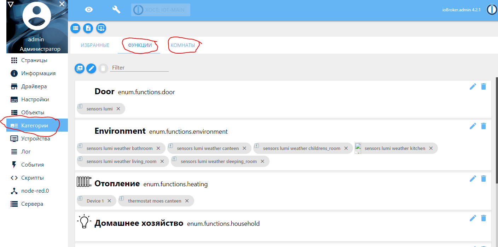
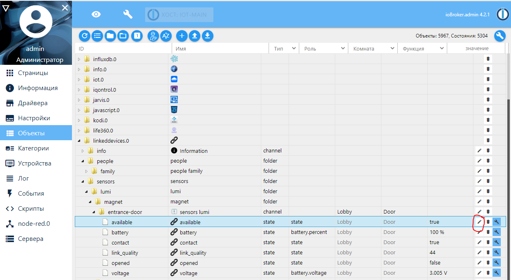
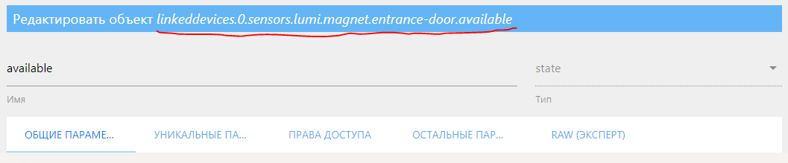
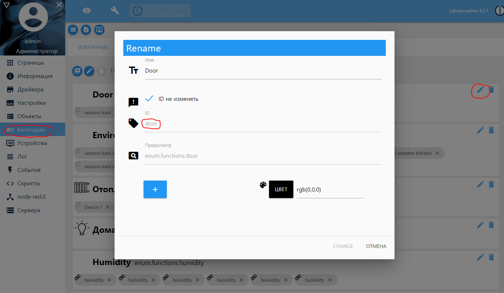
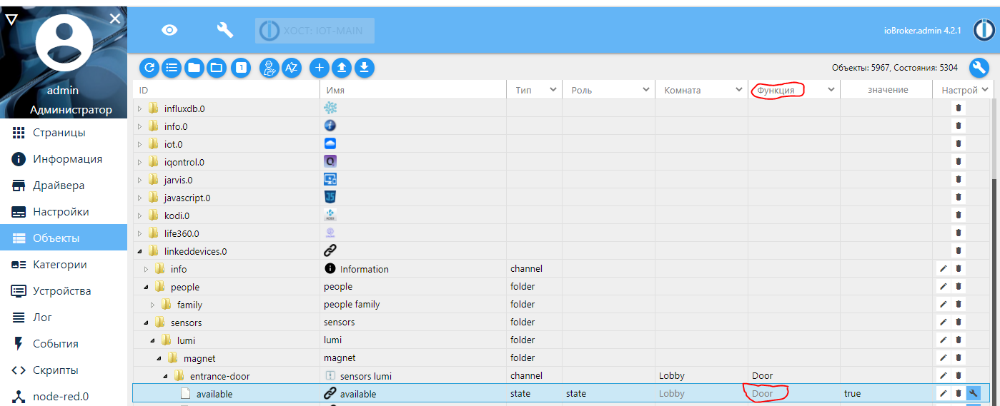
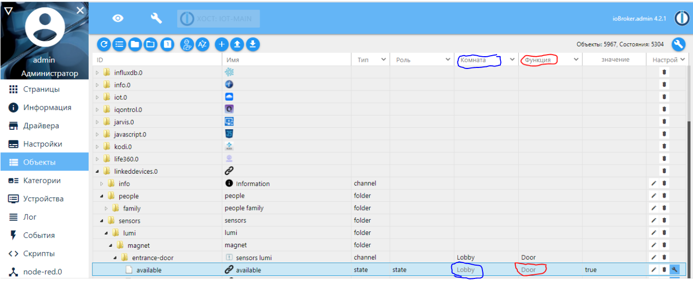
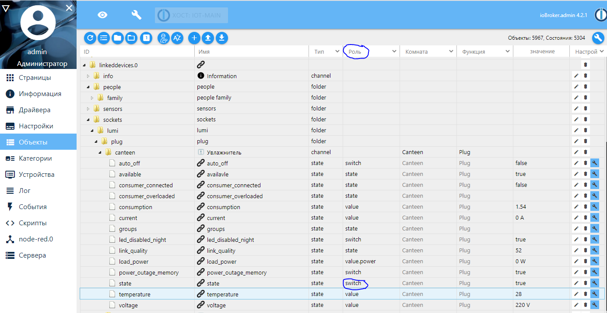
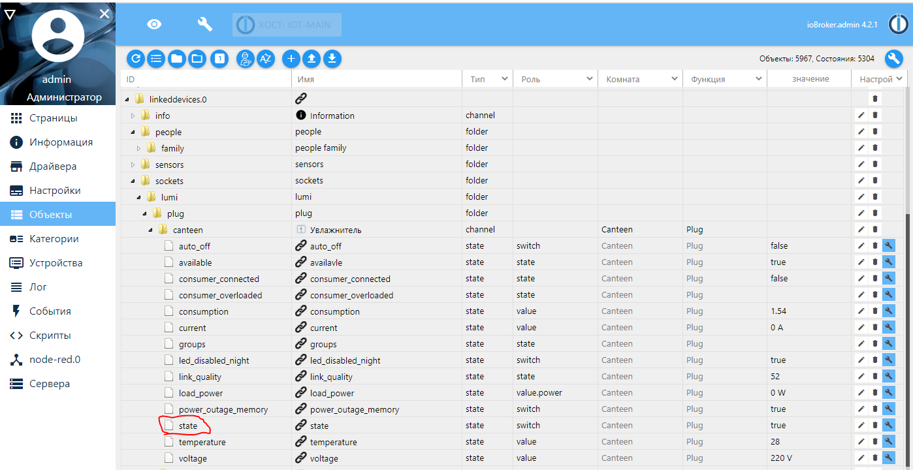
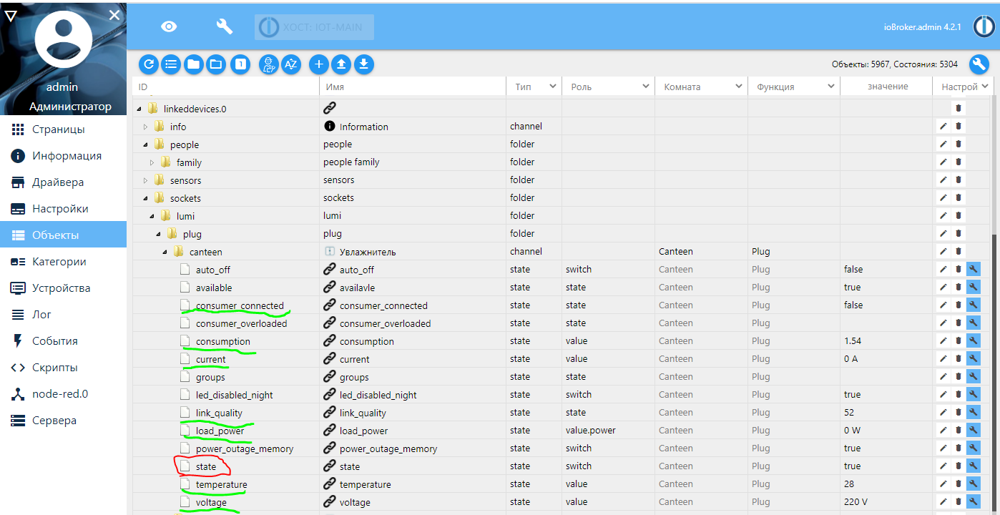

# ioBrokerTelegramMenuScript

Telegram bot with inline menu, based on https://blog.instalator.ru/archives/1996 by Vladimir Vilisov aka instalator.
- There is Russian language Readme.md.
- English one will come later.

## Отличия от оригинального скрипта
Мне было интересно сделать возможность автоматически генерировать элементы меню телеграмма, как с кнопками, так и с информацией, на базе объектов в [ioBroker](https://www.iobroker.net/), делать их разнесение по комнатам, на базе [Категорий](https://www.iobroker.net/#en/documentation/admin/enums.md).  

## Настроечные параметры
```
var options = {
    telegram:   'telegram.0',           // Инстанция драйвера
    backText:   '🔙 Назад',             // Надпись на кнопке Назад
    backCmd:    'back-',                 //Префикс команды кнопки Назад
    closeText:  '❌ Закрыть',           // Надпись на кнопке Закрыть
    closeCmd:   'close',                //Команда кнопки Закрыть
    homeText:   '🏚 Главная',           // Надпись на кнопке Домой
    homeCmd:    'home',                  //Команда кнопки Домой
    width:      3,                      // Максимальное количество столбцов с кнопками
    users_id:   [123456789,234567891],            // id пользователей которые имеют доступ к меню
    menucall:   ['Меню', 'меню', '/menu'],      // Команда для вызова меню
    menuPrefix: 'menu-',                // Префикс для отправляемых команд при нажатии на кнопку, можно не менять
    showHome:   true,                   // Показывать кнопку Домой
    showMsg:    true,                   // Показывать вплывающие сообщения
    language:   "ru",                   // Язык общения
    locale:     "ru-RU",                // Язык общения    
    debug:      false                    // Режим отладки, подробное логирование
};
```
В целом они взяты из оригинального скрипта, и на мой взгляд не требуют дополнительного пояснения. И, в общем-то - изменения.
Но прокомментирую два достаточно важных параметра:
* users_id - это массив идентификаторов пользователей телеграмм, кто имеет право работать с ботом. Узнать свой идентификатор можно с помощью других ботов, к примеру - @myidbot.
* menucall - массив текстовых строк, которые будут идентифицированы как команды запуска его меню. 

## Структура меню
Рассмотрим его пример из текста скрипта:
```
const menu = {
    name: 'Главное меню',
    icon: '⚙️',
    submenu: [
        { // Двери
            name: 'Двери',
            icon: '🚪',
            type: 'door',
            submenu: submenuGenerator
        },
        { // Освещение
            name: 'Освещение',
            icon: '💡',
            submenu: [
                {
                    name: 'Прихожая',
                    state: 'linkeddevices.0.switches.lonsonho.light.lobby.state',
                    icons: {on: '💡', off: '✖️'},
                    submenu: []
                },
            ]
        },
        { // Розетки
            name: 'Розетки',
            icon: '🔌',
            type: 'plug',
            submenu: submenuGenerator
        },         
        { // Информация
            name: 'Информация',
            icon: 'ℹ️',
            submenu: [
                {
                    name: 'Температура',
                    function: Environments,
                    param: 'temperature',
                    icon: '🌡',
                    submenu: []
                },
                {
                    name: 'Влажность',
                    function: Environments,
                    param: 'humidity', // А можно вызвать функцию вот так
                    icon: '💦',
                    submenu: []
                }
            ]
        },
    ]
};
}    
```
### Элементы меню
Каждый элемент меню представляет собой JavaScript объект.
#### Обязательные свойства объекта - элемента меню:
##### name
Текстовая строка, собственно определяющая то, что будет написано на кнопке меню, или в его заголовке.
##### submenu
Массив или функция генерации массива.
Так как свойство обязательное, то в случае отсутствия вложенных элементов меню требуется указать пустой массив ```[]```.
В скрипте есть встроенная функция генерации меню - ```submenuGenerator```.
##### icon или icons
Так же обязательное свойство, точнее, должен присутствовать один из двух вариантов.
- Если вы не предусматриваете изменения иконки в зависимости от состояния объекта, к которому привязан элемент меню - используете ```icon```, с указанием соответствующего эмодзи, искать удобно, к примеру, [здесь](https://www.emojicopy.com/) или [здесь](https://emojipedia.org/).
- Если же есть желание менять иконку в зависимости от состояния объекта - то используется свойство ```icons```. В настоящее время обрабатываются только состояния объекта, которые имеет логические значения (boolean). Соответственно для значение ```true``` используется свойство ```on```, Для ```false``` - ```off```. 
#### Дополнительные свойства объекта - элемента меню:
##### state
Ключевое свойство, хотя и не является обязательным. Используется в тех случаях, когда есть сложности с автогенерацией, либо вам так удобнее. 
Есть два варианта его значения:
- Это идентификатор объекта, который может принимать только логические (boolean) значения.
Его состояние влияет на выбор иконки кнопки (см. выше). Нажатие кнопки приведет к изменению значение объекта на противоположное. Точнее - скрипт попытается это сделать.
Получить его можно через интерфейс ioBroker, через редактирование объекта: , нажав на соответствующую кнопку, и потом скопировав строку c идентификатором: .
- Идентификатор JavaScript функции, которую вы напишите сами. В качества параметра данная функция получит объект - пункт меню.
Элементы меню могут не содержать свойство ```state```, но тогда они обязаны содержать не пустой массив вложенных элементов.
##### param
Вспомогательное свойство, для элементов меню, содержащих в свойстве ```state``` функцию. Используется на ваше усмотрение. Не является обязательным.
##### type
Вспомогательное свойство, обязательное в случае, если ```submenu``` функция ```submenuGenerator```. Определяет раздел в конфигурировании автогенерируемого вложенного меню.
Что не менее важно - значение должно соответствовать идентификатору одной из функций в разделе Категории ioBroker. 
#### Главное меню
Является обязательным. Но содержит только два обязательных элемента. Остальные - не обрабатываются.

## Конфигурация автогенерации вложенных элементов меню
Ключевыми элементами для автогенерации меню с помощью "встроенной" функции ```submenuGenerator```, являются:
- ~возможность найти элементы по маске~;
- объектам, для которых мы генерируем меню, должны быть заданы комната и функция из соответствующих категории. Без этого они не будут найдены и отображены.

Если объект входит более чем в одну комнату - в меню он будет отображен в каждой из них. Если у объекта больше одной роли - и для каждой есть свое генерируемое меню - он будет отображен в каждом таком меню.
```
const submenuParams = { 
    'plug' : 
        {
            mask : 'linkeddevices.0.sockets.*.plug.*.state',
            role : 'switch',
            state : 'state',
            rooms : false,
            icons : {on: '✅', off: '❌'},
            menuitems : 
                {
                    '.state' : 'Вкл/выкл', 
                    '.auto_off' : 'Автовыключение', 
                    '.led_disabled_night' : 'Выкл. индикатор', 
                    '.power_outage_memory' : 'Запоминать состояние'
                },
            report: reportGenerator,
            reportitems :
                {
                    '.consumer_connected'   : 'Нагрузка подключена', 
                    '.consumer_overloaded'  : 'Превышена нагрузка', 
                    '.current'              : 'Ток нагрузки', 
                    '.voltage'              : 'Напряжение в сети', 
                    '.temperature'          : 'Температура внутри', 
                    '.load_power'           : 'Текущее потребление',
                    '.consumption'          : 'Всего потреблено', 
                    '.link_quality'         : 'Уровень сигнала'
                },
            statusitems :
                {
                }
        },
    'door' :
        {
            mask : 'linkeddevices.0.sensors.*.magnet.*.opened',
            role : 'state',
            state: 'opened',
            icons : {on: '🔓', off: '🔐'},
            report: reportGenerator,
            menuitems : 
                {
                },
            reportitems :
                {
                    
                },
            statusitems :
                {
                    'lc' : 'Не менялся с',
                    'ack' : 'Потдвержден',
                    'ts' : 'По состоянию на',
                    'val' : {
                        'prefix' : 'Статус',
                        true : 'Открыта',
                        false : 'Закрыта'
                    }
                }                
        },
};
```
И снова объект JavaScript. На первом уровне вложенности - свойство со значением типа элемента (свойство type соответствующего элемента меню).
Каждый вложенный объект, описывающий соответствующий тип имеет некоторое количество обязательных свойств.
### Свойства типа генерируемого меню.
#### mask
~В данном случае - маска поиска соответствующих объектов ioBroker, аналогичная той, что используется в [селекторе объектов](https://github.com/ioBroker/ioBroker.javascript/blob/master/docs/en/javascript.md#---selector).~ Не используется.
#### role
Собственно роль объекта в интерфейсе ioBroker. 
#### state
Собственно "краткий" идентификатор объекта, его же вы видите в интерфейсе ioBroker. 
#### icons
Свойство, аналогичное описанному тому, что есть элементах меню. Будет использовано для генерируемых элементов меню, а так же в отчетах.
#### menuitems
Если с основным объектом, на одном уровне вложенности с ним в ioBroker есть и другие объекты, значения которых могут быть изменены, то можно их отобразить в виде вложенных элементов меню. К примеру, если у розетки есть не только функция включить/выключить, но и параметр - запомнить состояние, то это и будет таким объектом на одном уровне вложенности. 
В таком случае все, включая основной объект, описываются здесь, в формате ```'.идентификатор_объекта': 'Текст кнопки'```.
#### report
Задает функцию генерации отчета о состоянии элемента, если у объекта есть еще свойства, кроме основного, указанного в ```state``` и перечисленных в ```menuitems```, но которые вы хотели бы видеть, при входе в элемент меню. Например - потребление. Если используется "встроенная" функция '''reportGenerator''', то ее настройки указаны в '''reportitems'''
#### reportitems
Список объектов, не меняющих статус, но предоставляющих информацию о комплексом объекте, к примеру - потребление. Формат аналогичен ```menuitems```.
#### statusitems
Используется, если объекты, для которых мы генерируем меню, не предоставляет возможности изменить значение, к примеру - датчик открытия двери. Тогда при нажатии на соответствующую кнопку отобразится статус значения объекта. Список элементов ограничен ```ls, ack, ts. val```. Обязательно только наличие ```val```, и параметров дешифровки его состояния.
## Что получается в результате

